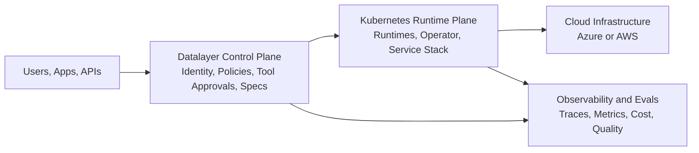
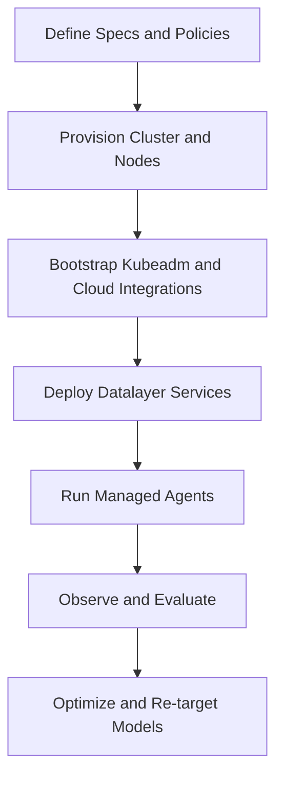

import DocCardList from '@theme/DocCardList';

# Datalayer Architecture

Clouder is the Kubernetes infrastructure and operations layer for Datalayer managed AI agents for data analysis.

It connects cloud resources, Kubernetes runtime control, and Datalayer services into one governed execution path.

## System View

## Why This Architecture

Datalayer is designed for long-running, data-intensive agent workflows that require more than prompt orchestration:

- Code-first plans to reduce token usage and model round-trips.
- Explicit guardrails by identity, permissions, and tool approvals.
- Durable execution with recovery, checkpointing, and runtime ownership.
- Continuous observability and evaluation across quality, latency, and cost.
- Portable specifications that are not locked to one model or provider.

Clouder operationalizes these requirements on Kubernetes.

## Clouder Responsibilities

At the Cloud-to-Plane boundary, Clouder provides:

- Cluster provisioning and lifecycle for Kubeadm-based deployments.
- Cloud-specific bootstrap for storage and load balancing.
- Reproducible setup and deployment through CLI and Terraform workflows.
- Service rollout orchestration for core Datalayer components.

## Runtime Plane Composition

A typical deployment includes:

- System services: ingress, cert-manager, observability, messaging, storage integrations.
- Core services: IAM, operator, runtimes, library, spacer, ai-agents, manager, status, scheduler, and related components.
- Kubernetes runtimes where data-analysis agents execute with policy and control-plane constraints.

## Cloud Integrations

Clouder currently supports Azure and AWS for Kubeadm infrastructure.

### Azure

- VM and network provisioning with Azure contexts.
- Storage bootstrap with Azure Disk CSI and Azure File CSI.
- Ingress/load balancer integration through Azure networking resources.

### AWS

- VM and network provisioning with AWS contexts.
- Storage bootstrap with AWS EBS CSI (`gp3` default StorageClass).
- Load balancer bootstrap via AWS Load Balancer Controller.

## Execution Lifecycle

## Operational Principles

- Keep policy ownership in your platform, not hidden provider defaults.
- Treat cloud bootstrap as part of runtime reliability, not a post-step.
- Prefer reproducible infrastructure and deployment paths.
- Validate continuously with observability and evals before and after changes.

Continue with the [Setup Guide](/cluster/) to provision infrastructure and deploy services.

<DocCardList />
