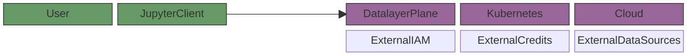
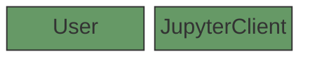
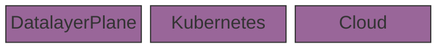
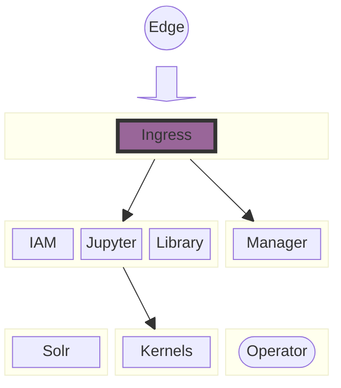

import ModalImage from "react-modal-image";

# Build a Platform

## Architecture

Datalayer is a managed platform that delivers Runtimes with custom integrations.

- IAM, included integration external providers (GitHub and JWT).
- Usage based billing, included intergation with external Credits providers.
- Variety of Datasets and external Data Sources.

## Edge

The user extends its existing AI solution and run code on the Runtimes:

- Via a local or remote [JupyterLab](https://jupyter-kernels.datalayer.tech/jupyterlab).
- Via a WEB Application, such as the the ones built with [Jupyter UI](https://jupyter-ui.datalayer.tech).
- Via a [Command Line Interface](https://jupyter-kernels.datalayer.tech/cli/) (CLI).
- Via a [JupyterHub](/platform/integrations/jupyterhub).

## Kubernetes

You need a combination of technologies and deployments to run the [Datalayer Plane on Kubernetes](/platform/kubernetes).

