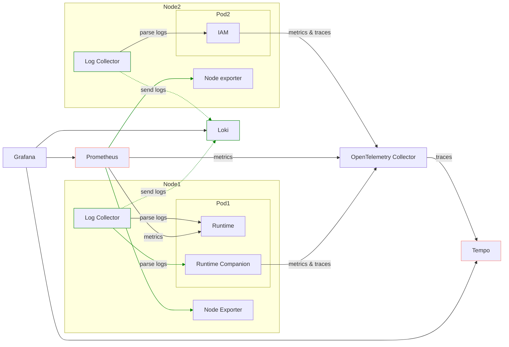

import Tabs from '@theme/Tabs';
import TabItem from '@theme/TabItem';
import ModalImage from "react-modal-image";

# Observer

:::warning

**🚨 DEPRECATED** - The Datalayer Observer is deprecated and will be removed in a future release. It is replaced by the [Datalayer OTEL](/services/system/otel) service that only deploys the OpenTelemetry Collector and relies on the services to be instrumented and to send their telemetry to it.

:::

The Datalayer Observer Helm Chart installs the needed `Observability` tooling for the Datalayer Platform to be operated in production.

- [Loki](https://grafana.com/oss/loki) is used to gather logs of all the services in a central place.
- [Tempo](https://grafana.com/oss/tempo) is used to gather traces.
- [Prometheus](https://prometheus.io) is used to gather metrics.
- [Prometheus Alert Manager](https://prometheus.io/alerting/latest/alertmanager) is used to create and manage the alerts.
- [OpenTelemetry Collector](https://opentelemetry.io/docs/collector) used as Kubernetes Deployment to proxy metrics and traces from Datalayer services to Prometheus and Tempo and also used as Kubernetes Daemonset to parse pod log files and send them to Loki.
- [Grafana](https://grafana.com/grafana) is used to visualize and analyze the gathered information.

<div style={{marginBottom: 20}}>
<ModalImage
  small="https://images.datalayer.io/legacy/observer/observer-detailed-view.png"
  large="https://images.datalayer.io/legacy/observer/observer-detailed-view.png"
  alt=""
/>
</div>

## Install

<Tabs groupId="k8s">
  <TabItem value="plane" label="Plane" default>
```bash
plane up datalayer-observer
```
  </TabItem>
  <TabItem value="terraform" label="Terraform">
```bash
cd terraform
terraform init
terraform apply
./generated/clouder-Kubeadm-setup.sh
export KUBECONFIG=~/.clouder/kubeconfigs/kubeconfig-<cluster-name>
./generated/services/deploy-datalayer-observer.sh
```
  </TabItem>
</Tabs>

The first time, you will likely get an error preventing the Opentelemetry collectors to be created. Executing the `up` command a second time should pass.

If you face some issues due to the OpenTelemetry operator, it is likely related to the CRDs being undefined in the cluster. You can install them manually from `plane/etc/helm/charts/datalayer-observer/charts/crds/crds`.

:::note

Helm should install them the first time. But this is a complex thing to handle, see [this link for more information](https://helm.sh/chart_best_practices/custom_resource_definitions/#install-a-crd-declaration-before-using-the-resource).

:::

The `datalayer-observer` chart deploys multiple subcharts:

- [Kube Prometheus Stack]( https://prometheus-community.github.io/helm-charts) chart.
    - Prometheus Operator.
    - Prometheus.
    - Prometheus Node Exporter.
    - AlertManager.
    - Grafana.
- [Loki](https://grafana.github.io/helm-charts) chart.
- [Tempo](https://grafana.github.io/helm-charts) chart.
- [OpenTelemetry Operator](https://github.com/open-telemetry/opentelemetry-collector-contrib) chart.
- Additional CRDs for OpenTelemetry.

The deployment will result in:

- An `OpenTelemetry Collector` as a single Pod/Service to proxy received traces and metrics to Prometheus and Tempo.
- A `Log Collector` as Daemonset to parse the containers log files and proxy them to Loki.
- A `Service Monitor` to tell Prometheus to fetch the metrics:
  - From the `OpenTelemetry Collector` singleton.
  - From the `Runtimes`, we use the builtin Jupyter Server Prometheus endpoint.
- An `Ingress` for Grafana to be exposed in a similar way as the other Datalayer services.
- `Cluster Roles` for the `Collectors` in order to use the Kubernetes API to fetch Pods and Nodes metadata to enrich the Telemetry metadata.



## Uninstall

```bash
plane down datalayer-observer
```

:::warning

The Opentelemetry collectors will unfortunately not be removed - the associated CRDs are failing to be deleted.

You will need to edit them manually to remove the finalizer as the OpenTelemetry operator is down.

Then normally all associated Pods should be removed.

If needed, you will have to [force delete](/cluster/kubernetes/namespaces/#delete-namespace) the `datalayer-observer` namespace.

:::

## Metadata

OpenTelemetry requires the services to be distinguished using a triplet (`service.name`, `service.namespace`, `service.instance.id`) - only the first one is mandatory. But Prometheus requires services to be distinguished using a doublet (`job` | `pod`, `instance`).

Therefore, as recommended in OpenTelemetry documentation, the following mapping is applied: `job` == `service.namespace`; `instance` == `service.instance.id`.

Those metadata are set from:

- `service.name`:
  - Enforce on telemetry send by datalayer services
  - Extracted from container name for logs
- `service.namespace`: Kubernetes namespace
- `service.instance.id`: Kubernetes pod id

The other metadata normalized (in Loki, Tempo and Prometheus) are:

- `app`: Kubernetes pod label `datalayer.io/app`
- `namespace`: Kubernetes namespace
- `pod`: Kubernetes pod name
- `cluster`: Value from `$DATALAYER_RUN_HOST`
- `instance`: Kubernetes instance

For the Runtimes, the following metadata are also added:

- `datalayer.pool.name`: Kubernetes label `runtime-pools.datalayer.io/name`
- `datalayer.pool.status`: Kubernetes label `runtime-pools.datalayer.io/pod-status`
- `datalayer.pool.user`: Kubernetes label `runtime-pools.datalayer.io/user-uid`
- `datalayer.pool.type`: Kubernetes label `runtime-pools.datalayer.io/runtime-type`
- `datalayer.pool.reservation`: Kubernetes label `runtime-pools.datalayer.io/reservation-id`

## Prometheus

Prometheus gets its data source definition from CRDs `PodMonitor` and `ServiceMonitor`.

Third-parties that don't support OpenTelemetry metrics use such monitors and therefore are not proxied by the OpenTelemetry collector.

- `ServiceMonitor`
   - Used by Grafana, AlertManager, Loki, Tempo, Prometheus, Prometheus Operator, Prometheus Node Exporter and OpenTelemetry Collector singleton.
   - To be detected by Prometheus the ServiceMonitor must have the two labels:

```yaml
monitoring.datalayer.io/enabled: true
monitoring.datalayer.io/instance: "observer"
```

  - Kubernetes metrics are also gathered through service monitors defined in the kube-prometheus-stack.

- `PodMonitor`: used by Pulsar stack (default in the Helm Chart).
   - PodMonitor can be defined in any namespace 
   - To be detected by Prometheus the PodMonitor must have a label `app=pulsar`.
   - Other values for the app label could be defined in the `kube-prometheus-stack.prometheus.prometheusSpec.podMonitorSelector`.

```yaml
app: pulsar
```

## Instrumentation

### Services

The services are instrumented explicitly using the code defined in `datalayer_common.instrumentation` as a custom version of the Python instrumentation ASGI was needed in particular to push the HTTP route metadata.

:::warning

The logging instrumentor is used as by default it calls `basicConfig`. The service must not call it.

:::

Configure the metrics and traces targets is done through environment variables.

```bash
export OTEL_SDK_DISABLED="true"
export OTEL_EXPORTER_OTLP_METRICS_ENDPOINT=http://datalayer-collector-collector.datalayer-observer.svc.cluster.local:4317
export OTEL_EXPORTER_OTLP_TRACES_ENDPOINT=http://datalayer-observer-tempo.datalayer-observer.svc.cluster.local:4317
```

:::info

Currently the data is sent using gRPC.

HTTP is also available but would require to change the instrumentation code as the library to use is different.

:::

### Runtimes

There is for now no custom instrumentation, nor custom log format. Only metrics from the standard Jupyter Server prometheus endpoint are gathered.

:::warning

Currently no traces are observed for the Runtimes.

:::

#### Non-working Instrumentation

Auto-instrumentation by the OpenTelemetry operator via a CRD `Instrumentation` was tried but it did not work. That CRD must be defined in the namespace the Pod is going to be created and the instrumentation will occur only at the Pod creation.

A Pod is selected for instrumentation if it gets some annotations. In this specific case, to instrument Python on a multi-container pod:

```yaml
instrumentation.OpenTelemetry.io/inject-python: true
instrumentation.OpenTelemetry.io/container-names: "{RUNTIME_CONTAINER_NAME}"
```

:::note

See [this README](https://github.com/open-telemetry/OpenTelemetry-operator?tab=readme-ov-file#OpenTelemetry-auto-instrumentation-injection) for more information and available options to be set through environment variables.

:::

The Python auto-instrumentation is using HTTP to send data to the OpenTelemetry Collector.

## Grafana

Grafana will be available on this URL.

```bash
open ${DATALAYER_RUN_URL}/grafana
```

If you did not set an `admin` password, it was set using a random string in Kubernetes secret. You can print it by executing the following command.

```bash
kubectl get secret --namespace datalayer-observer \
  -l app.kubernetes.io/name=grafana \
  -o=jsonpath="{.items[0].data.admin-password}" | base64 --decode
echo
```

Use the `admin` and the printed `password` credentials to connect via the Grafana Web page.

`Grafana` is the de-facto tool for exploring all telemetry (logs, traces and metrics); in particular the _Explore_ panel.

- `Prometheus`: Query using a label filter on `service_name` (e.g. _iam_). It is usually easier than starting with a metric names as those are not standardize across services (neither in name nor in unit - that appears in the name).
- `Loki`: Query using a label filter on `service_name` (e.g. _iam_). When clicking on a log entry, you will access its metadata and a link to the associated trace (if available).
- `Tempo`: Query the data using setting a `Service name`. Traces are usually not the best places to start, better use logs that will link the associated trace.

On top of the standard technical stack (Pulsar, Ceph...) dashboards, we have prepared custom dashboards to help with the observation. The dashboards definitions are available in this [grafana-dashboards GitHub repository](https://github.com/datalayer/grafana-dashboards).

### Services

<ModalImage
  small="https://images.datalayer.io/legacy/observer/observer-services.png"
  large="https://images.datalayer.io/legacy/observer/observer-services.png"
  alt=""
/>

### Main View

<ModalImage
  small="https://images.datalayer.io/legacy/observer/observer-overall-view.png"
  large="https://images.datalayer.io/legacy/observer/observer-overall-view.png"
  alt=""
/>

### Detailed View

<ModalImage
  small="https://images.datalayer.io/legacy/observer/observer-detailed-view.png"
  large="https://images.datalayer.io/legacy/observer/observer-detailed-view.png"
  alt=""
/>

<!--

```bash
kubectl get pods -n datalayer-observer
kubectl get ingress -n datalayer-observer
kubectl describe cert datalayer-observer-cert-secret -n datalayer-observer
```

```bash
open https://${DATALAYER_RUN_HOST}/prometheus
open ${DATALAYER_RUN_URL}/grafana
```

```bash
cat <<EOF | kubectl apply -f -
apiVersion: monitoring.coreos.com/v1
kind: PodMonitor
metadata:
  name: pod-monitor-jupyter-available
  namespace: datalayer-observer
  labels:
    monitoring.datalayer.io/name: datalayer-runtimes
spec:
  podMetricsEndpoints:
  - interval: 10s
    path: /metrics
    targetPort: 2300
  namespaceSelector:
    matchNames:
    - datalayer-runtimes
  selector:
    matchLabels:
      runtime-pools.datalayer.io/pod-status: available
EOF
kubectl get podmonitor pod-monitor-jupyter-available -n datalayer-observer
kubectl delete podmonitor pod-monitor-jupyter-available -n datalayer-observer
```

```bash
cat <<EOF | kubectl apply -f -
apiVersion: monitoring.coreos.com/v1
kind: PodMonitor
metadata:
  name: pod-monitor-jupyter-assigned
  namespace: datalayer-observer
  labels:
    monitoring.datalayer.io/name: datalayer-runtimes
spec:
  podMetricsEndpoints:
  - interval: 10s
    path: /metrics
    targetPort: 2300
  namespaceSelector:
    matchNames:
    - datalayer-runtimes
  selector:
    matchLabels:
      runtime-pools.datalayer.io/pod-status: assigned
EOF
kubectl get podmonitor pod-monitor-jupyter-assigned -n datalayer-observer
kubectl delete podmonitor pod-monitor-jupyter-assigned -n datalayer-observer
```

-->
