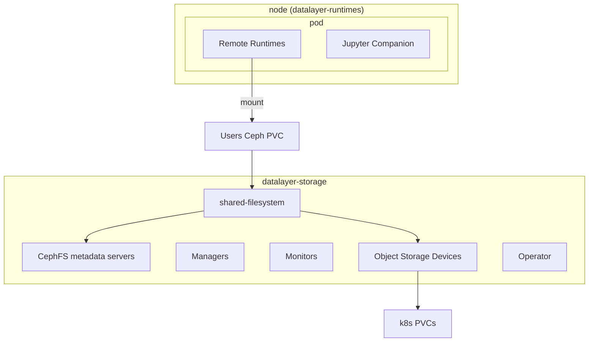

import Tabs from '@theme/Tabs';
import TabItem from '@theme/TabItem';

# Shared File System

Datalayer user data is stored on a Shared File System. The File System Storage can be implemented as a:

- [AWS EFS](https://docs.aws.amazon.com/efs) mounted through the EFS CSI driver.
- [Azure Files NFS](https://learn.microsoft.com/en-us/azure/storage/files/files-nfs-protocol).
- [Ceph](https://docs.ceph.com/) Filesystem deployed and managed by [Rook](https://rook.io/).

## AWS EFS

Define the storage provider as `aws`.

```bash
DATALAYER_STORAGE_PROVIDER=aws
```

### Prerequisites

The `aws-efs` StorageClass and the backing EFS infrastructure must be provisioned by platform automation before running `plane up datalayer-shared-filesystem`.

Users should not have to manually create an EFS file system or manually manage an EFS file system ID for this flow.

You need:

- The AWS EFS CSI driver installed in the cluster.
- An automation-managed `aws-efs` StorageClass.

<Tabs>
<TabItem value="Kubeadm" label="Kubeadm (Clouder)" default>

Validate the StorageClass is available:

```bash
# Verify the StorageClass exists
kubectl get storageclass aws-efs
```

</TabItem>
<TabItem value="eks" label="EKS / Terraform">

Use your Terraform/cluster automation workflow to provision EFS and `aws-efs` before deploying `datalayer-shared-filesystem`.

</TabItem>
</Tabs>

### Deploy

<Tabs groupId="k8s">
  <TabItem value="plane" label="Plane" default>
```bash
plane up datalayer-shared-filesystem
```
  </TabItem>
  <TabItem value="terraform" label="Terraform">
```bash
cd terraform
terraform init
terraform apply
./generated/clouder-Kubeadm-setup.sh
export KUBECONFIG=~/.clouder/kubeadm/<cluster-name>/kubeconfig
./generated/services/deploy-datalayer-shared-filesystem.sh
```
  </TabItem>
</Tabs>

You can check the AWS EFS-backed shared filesystem with the following commands.

```bash
kubectl get pvc -n datalayer-runtimes
# NAME                STATUS   VOLUME                                     CAPACITY   ACCESS MODES   STORAGECLASS   VOLUMEATTRIBUTESCLASS   AGE
# shared-fs-pvc       Bound    pvc-xxxxxxxx-xxxx-xxxx-xxxx-xxxxxxxxxxxx   100Gi      RWX            aws-efs        <unset>                 70s
kubectl get pv | grep datalayer-runtimes
# pvc-xxxxxxxx-xxxx-xxxx-xxxx-xxxxxxxxxxxx   100Gi          RWX            Delete           Bound      datalayer-runtimes/shared-fs-pvc       aws-efs
kubectl get storageclass aws-efs
```

A `shared-fs-prepare` Pod is launched to create the initial folders in the shared filesystem. The volume is mounted on `/mnt/shared-fs`.

```bash
kubectl logs shared-fs-prepare -n datalayer-runtimes
# + mkdir -p /mnt/shared-fs/home
# + chown 1000:100 /mnt/shared-fs/home
# + mkdir -p /mnt/shared-fs/public
# + chown 1000:100 /mnt/shared-fs/public
# + mkdir -p /mnt/shared-fs/datasets
# + chown 1000:100 /mnt/shared-fs/datasets
# + mkdir -p /mnt/shared-fs/tmp
# + chown 1000:100 /mnt/shared-fs/tmp
kubectl exec shared-fs-prepare -n datalayer-runtimes -it -- mount | grep /mnt/shared-fs
# fs-xxxxxx.efs.<region>.amazonaws.com:/ on /mnt/shared-fs type nfs4 (...)
kubectl exec shared-fs-prepare -n datalayer-runtimes -it -- ls /mnt/shared-fs
kubectl exec shared-fs-prepare -n datalayer-runtimes -it -- sh
kubectl delete pod shared-fs-prepare -n datalayer-runtimes
```

Tear down when you don't need the Shared Filesystem anymore.

```bash
plane down datalayer-shared-filesystem
```

## Azure Files NFS

Define the storage provider as `azure`.

```bash
DATALAYER_STORAGE_PROVIDER=azure
```

### Prerequisites

The `azure-nfs` StorageClass must exist **before** running `plane up datalayer-shared-filesystem`. The helm chart creates the PVCs but does **not** create the StorageClass for Azure — it is expected to be provisioned at the infrastructure level.

<Tabs>
<TabItem value="Kubeadm" label="Kubeadm (Clouder)" default>

On Kubeadm clusters created with Clouder, `clouder kubeadm setup` already creates the `azure-nfs` StorageClass with the correct Azure subscription, resource group, and location baked in. No additional steps are needed.

```bash
# Verify the StorageClass exists
kubectl get storageclass azure-nfs
```

</TabItem>
<TabItem value="aks" label="AKS / Manual">

On AKS or other clusters, create the StorageClass manually. On AKS, the `subscriptionID`, `resourceGroup`, and `location` parameters can be omitted (auto-detected from IMDS).

```bash
cat <<'EOF' | kubectl apply -f -
apiVersion: storage.k8s.io/v1
kind: StorageClass
metadata:
  name: azure-nfs
provisioner: file.csi.azure.com
allowVolumeExpansion: true
parameters:
  shareName: datalayer-shared-filesystem
  skuName: Premium_LRS
  protocol: nfs
  # Required on non-AKS clusters (Kubeadm, etc.):
  # subscriptionID: "<subscription-id>"
  # resourceGroup: "<resource-group>"
  # location: "<region>"
EOF
```

</TabItem>
</Tabs>

### Deploy

<Tabs groupId="k8s">
  <TabItem value="plane" label="Plane" default>
```bash
plane up datalayer-shared-filesystem
```
  </TabItem>
</Tabs>

Verify:

```bash
kubectl get pvc -n datalayer-runtimes
kubectl get pv | grep datalayer-runtimes
kubectl get storageclass azure-nfs
kubectl logs shared-fs-prepare -n datalayer-runtimes
```

Tear down when you don't need the Shared Filesystem anymore.

```bash
plane down datalayer-shared-filesystem
```

## Ceph

Define the storage provider as `ceph`.

```bash
DATALAYER_STORAGE_PROVIDER=ceph
```

The installation is a 3 steps process.

1. Install the Rook Operator for Ceph.

```bash
plane up datalayer-storage-operator
```

This installs the Rook Operator pod. Check the availabilty of the Rook Operator with the following command.

```bash
kubectl get pod -n datalayer-storage -l app=rook-ceph-operator
```

2. Install a Ceph Cluster.

```bash
plane up datalayer-storage-cluster
```

This installs the Ceph Cluster (you will still need to create the effective Ceph Filesystem on the Cluster). You can check the Ceph Cluster with the following commands.

```bash
kubectl get cephcluster $DATALAYER_RUN_HOST -n datalayer-storage -w
# NAME                DATADIRHOSTPATH   MONCOUNT   AGE     PHASE         MESSAGE                 HEALTH   EXTERNAL   FSID
# oss.datalayer.run   /var/lib/rook     3          8s    Progressing   Detecting Ceph version
# oss.datalayer.run   /var/lib/rook     3          3m59s   Progressing   Configuring the Ceph Cluster                          f54e114c-6947-4811-b8b3-3b4240c4931c
# oss.datalayer.run   /var/lib/rook     3          3m59s   Progressing   Configuring Ceph Mons                                 f54e114c-6947-4811-b8b3-3b4240c4931c
# oss.datalayer.run   /var/lib/rook     3          4m24s   Progressing   Configuring Ceph Mgr(s)                               f54e114c-6947-4811-b8b3-3b4240c4931c
# oss.datalayer.run   /var/lib/rook     3          4m25s   Progressing   Configuring Ceph OSDs                                 f54e114c-6947-4811-b8b3-3b4240c4931c
# oss.datalayer.run   /var/lib/rook     3          4m46s   Progressing   Processing OSD 0 on node "aks-ce..."                  f54e114c-6947-4811-b8b3-3b4240c4931c
# oss.datalayer.run   /var/lib/rook     3          4m57s   Ready         Cluster created successfully            HEALTH_OK              f54e114c-6947-4811-b8b3-3b4240c4931c
# 
kubectl describe cephcluster $DATALAYER_RUN_HOST -n datalayer-storage 
```

The cluster is now equipped to provision Filesystems (see following step).

:::warning

Be sure to wait for the cluster to be ready and healthy. This steps has proven to be quite highly dependent on your nodes sizing especially to get OSDs up and running.

We recommend 5 nodes with 4 CPU and 16 GB each.

:::

You can see the cluster status in the Grafana dashboard `Ceph Cluster` entry.

You can also use the native Ceph dashboard. Run a port-forward proxy, get the password, and login with the `admin` user on http://localhost:7000.

```bash
plane pf-ceph
```

3. Create a Shared Filesystem PVC for the user data in the `datalayer-runtimes` namespace with the following command.

```bash
plane up datalayer-shared-filesystem
```

You can check the Ceph Filesystem with the following commands.

```bash
kubectl get cephfilesystem shared-filesystem -n datalayer-storage
kubectl get cephfilesystemsubvolumegroups shared-filesystem-csi -n datalayer-storage
```

A `shared-fs-prepare` Pod has been launched and is responsible to create the storage initial folders. The shared filesystem is mounted on `/mnt/shared-fs`.

```bash
kubectl logs shared-fs-prepare -n datalayer-runtimes
# + mkdir -p /mnt/shared-fs/home
# + chown 1000:100 /mnt/shared-fs/home
# + mkdir -p /mnt/shared-fs/public
# + chown 1000:100 /mnt/shared-fs/public
# + mkdir -p /mnt/shared-fs/datasets
# + chown 1000:100 /mnt/shared-fs/datasets
# + mkdir -p /mnt/shared-fs/tmp
# + chown 1000:100 /mnt/shared-fs/tmp
kubectl exec shared-fs-prepare -n datalayer-runtimes -it -- mount | grep /mnt/shared-fs
# 10.0.110.3:6789,10.0.202.233:6789,10.0.44.146:6789:/volumes/csi/csi-vol-a66fdf1a-7046-4bed-8d21-846d9b84f4df/23dde9c7-67f3-40a1-8329-49d93cd6a8de on /mnt/shared-fs type ceph (rw,relatime,name=csi-cephfs-node,secret=<hidden>,fsid=00000000-0000-0000-0000-000000000000,acl,mds_namespace=shared-filesystem)
kubectl exec shared-fs-prepare -n datalayer-runtimes -it -- sh
kubectl delete pod shared-fs-prepare -n datalayer-runtimes
```

**What is deployed?**

The first piece is the Rook Ceph Operator. Then we create through a Custom Resource a Ceph Cluster using PVC as storage backend; see `cephClusterSpec.storage.storageClassDeviceSets`. This is important as it defines the real amount of available storage (that will contain all data replication).

As part of that spec, the second important point is the provisioning of a Ceph FileSystem (see `cephFileSystems`). In particular, it defines the number of data and metadata replication as well as the metadata server.

The final part creates a Ceph shared storage through PVC on top of the Ceph FileSystem to be mounted in the Remote Runtime nodes.



**Configuration**

Ceph Operator Configuration

The Ceph Operator configuration is defined in `datalayer-storage/values.yaml`. You can find more information about the available values in the [rook documentation](https://rook.io/rook/latest-release/Helm-Charts/operator-chart).

Ceph Cluster Configuration

The Ceph Cluster configuration is defined in `datalayer-storage-cluster/values.yaml`. You can find more information about the available values in the [rook documentation](https://rook.io/rook/latest-release/Helm-Charts/ceph-cluster-chart).

Of particular importance are the configuration for the OSDs `cephClusterSpec.storage.storageClassDeviceSets` (the _real_ storage) and the provisioned Ceph storage `cephFileSystems` (e.g. a Filesystem).

:::note

The [deployment examples](https://github.com/rook/rook/tree/master/deploy/examples) can provide direction to tune a configuration depending on the scenario.

:::

Ceph Storage Configuration

The users ceph storage is defined on top of the provisioned Filesystem as a PVC through a custom `storageClassName` (itself defined in the ceph cluster configuration).

That chart also defines an pod to set up the default content of the volume.

**How to uninstall?**

Make sure to check all resources are deleted before moving to the next steps. If you don't it is highly probable something will go wrong and you will have to delete resource manually (including editing specs to remove finalizers).

We advice you to read the [teardown documentation](https://rook.io/rook/latest-release/Storage-Configuration/ceph-teardown) before running the following commands.

1. Delete Shared Filesystem

:::danger

You will loose the complete users data.

:::

```bash
plane down datalayer-shared-filesystem
```

You may need to manually remove the following objects in case of up/down not working (edit them to remove the finalizers).

```bash
# Remove the finalizers.
kubectl edit pvc $DATALAYER_USERS_PVC_NAME -n datalayer-runtimes
kubectl delete pvc $DATALAYER_USERS_PVC_NAME -n datalayer-runtimes
# Remove the finalizers.
kubectl edit cephfilesystemsubvolumegroups shared-filesystem-csi -n datalayer-storage
kubectl delete cephfilesystemsubvolumegroups shared-filesystem-csi -n datalayer-storage
# Remove the finalizers.
kubectl edit cephfilesystem shared-filesystem -n datalayer-storage
kubectl delete cephfilesystem shared-filesystem -n datalayer-storage
```

2. Delete Ceph Cluster

```bash
plane down datalayer-storage-cluster
```

:::note

By default the Filesystem is not deleted; see `cephFileSystems[0].preserveFilesystemOnDelete`.

To delete the Filesystem, you need to remove the finalizer.

```bash
kubectl edit cephcluster $DATALAYER_RUN_HOST -n datalayer-storage
kubectl delete cephcluster $DATALAYER_RUN_HOST -n datalayer-storage
```

:::

3. Delete Ceph Operator

```bash
plane down datalayer-storage-operator
```

## Tips and Tricks for Ceph

### Monitoring

The default values are configuring the gathering of metrics by the Prometheus instance handles in `datalayer-observer`.

Grafana dashboards for Ceph are also provisioned in `datalayer-observer` and should be populated out-of-the-box with the Ceph metrics.

### Handling Ceph OSDs

Refer to the [Rook documentation](https://rook.io/rook/latest-release/Storage-Configuration/Advanced/ceph-osd-mgmt) to remove or add OSDs.

### Scaling Ceph Global Storage

The [Rook documentation](https://rook.io/rook/latest-release/Storage-Configuration/Advanced/ceph-configuration/#auto-expansion-of-osds) describes how to scale up OSDs vertically and horizontally.

:::tip

On the Web, the recommendation is to prefer growing horizontally rather than vertically.

:::
