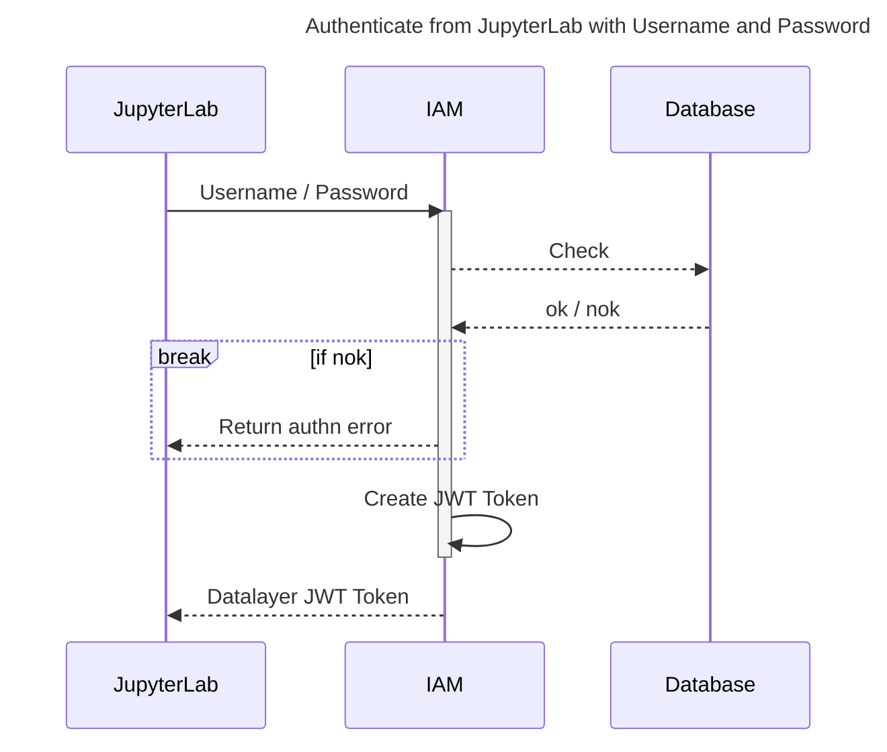
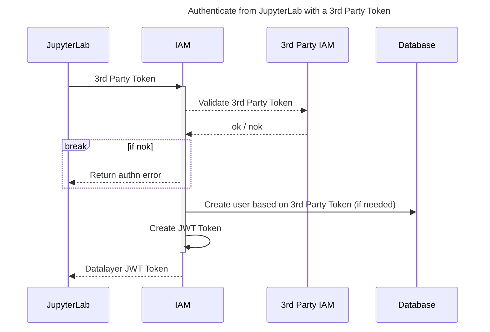
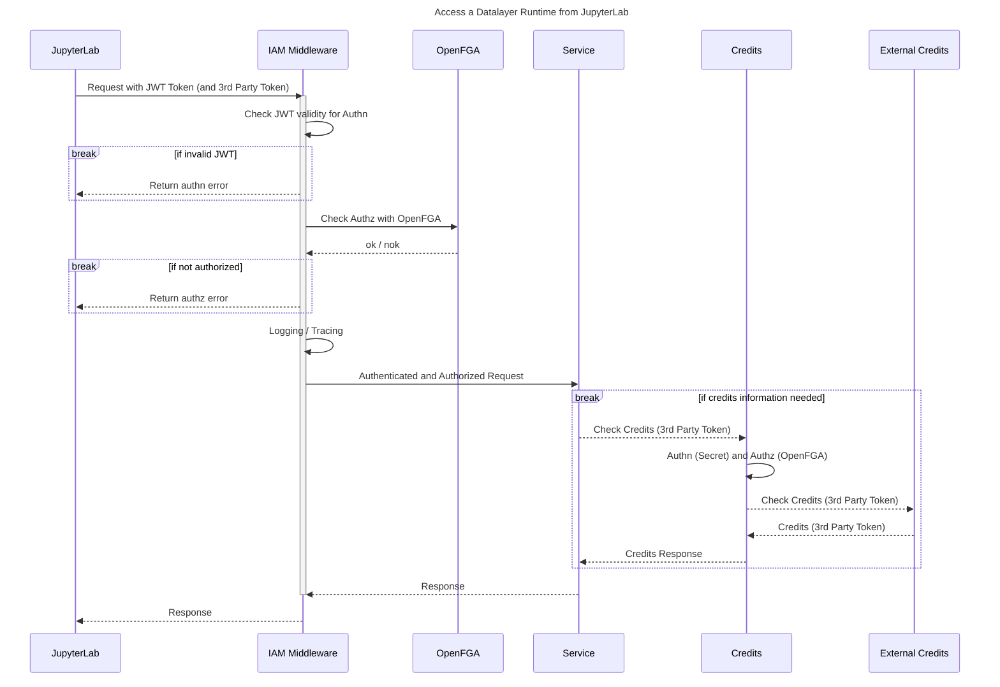
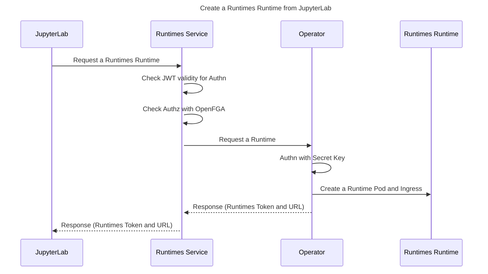
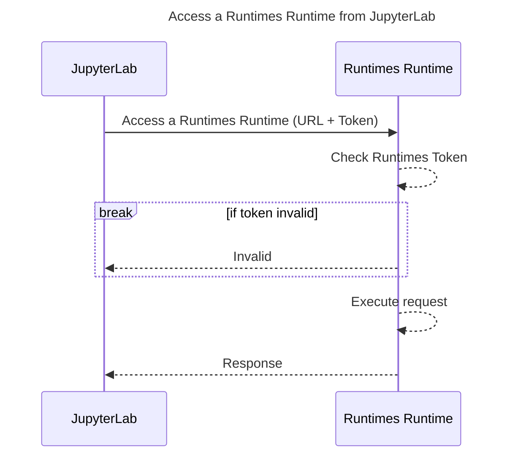

import Tabs from '@theme/Tabs';
import TabItem from '@theme/TabItem';
import { Label, Stack } from '@primer/react-brand';

# ☰ 🛂 Datalayer IAM

<Stack direction="horizontal" alignItems="flex-start" padding="none" style={{marginBottom: 30}}>
  <Label color="blue">Kubernetes</Label>
  <Label color="red">REST API</Label>
</Stack>

`Datalayer IAM` service provides the Identity and Access management to Datalayer and supports a variety of Authentication and Authorisation methods. It allows to manage the following artifacts.

```
🛂 Personal and Organisation Accounts.

🧑‍🤝‍🧑 Teams.

🛡️ Authorization Policies.
```

## Deploy Datalayer IAM

<Tabs groupId="k8s">
  <TabItem value="plane" label="Plane" default>
```bash
plane up datalayer-iam
```
  </TabItem>
  <TabItem value="helm" label="Helm">
```bash
export RELEASE=datalayer-iam
export NAMESPACE=datalayer-api
helm upgrade \
  --install $RELEASE \
  oci://${DATALAYER_HELM_REGISTRY_HOST}/datalayer-charts/iam \
  --create-namespace \
  --namespace $NAMESPACE \
  --set iam.image="${DATALAYER_DOCKER_REGISTRY}/iam:0.1.1" \
  --set iam.certificateIssuer="letsencrypt" \
  --set iam.env.DATALAYER_RUN_HOST="${DATALAYER_RUN_HOST}" \
  --set iam.env.DATALAYER_CDN_URL="${DATALAYER_CDN_URL}" \
  --set iam.env.DATALAYER_RUNTIME_ENV="${DATALAYER_RUNTIME_ENV}" \
  --set iam.env.DATALAYER_IAM_API_KEY="${DATALAYER_IAM_API_KEY}" \
  --set iam.env.DATALAYER_JWT_ISSUER="${DATALAYER_JWT_ISSUER}" \
  --set iam.env.DATALAYER_JWT_SECRET="${DATALAYER_JWT_SECRET}" \
  --set iam.env.DATALAYER_JWT_ALLOWED_ISSUERS="${DATALAYER_JWT_ALLOWED_ISSUERS}" \
  --set iam.env.DATALAYER_JWT_ALGORITHM="${DATALAYER_JWT_ALGORITHM}" \
  --set iam.env.DATALAYER_JWT_DEFAULT_KID_ISSUER="${DATALAYER_JWT_DEFAULT_KID_ISSUER}" \
  --set iam.env.DATALAYER_JWT_SKIP_3RD_TOKEN_SIGNATURE_VERIFICATION="${DATALAYER_JWT_SKIP_3RD_TOKEN_SIGNATURE_VERIFICATION}" \
  --set iam.env.DATALAYER_AUTHZ_ENGINE="${DATALAYER_AUTHZ_ENGINE}" \
  --set iam.env.DATALAYER_CHECKOUT_PROVIDER="${DATALAYER_CHECKOUT_PROVIDER}" \
  --set iam.env.DATALAYER_SUPPORT_EMAIL="${DATALAYER_SUPPORT_EMAIL}" \
  --set iam.env.DATALAYER_SMTP_HOST="${DATALAYER_SMTP_HOST}" \
  --set iam.env.DATALAYER_SMTP_PORT="${DATALAYER_SMTP_PORT}" \
  --set iam.env.DATALAYER_SMTP_USERNAME="${DATALAYER_SMTP_USERNAME}" \
  --set iam.env.DATALAYER_SMTP_PASSWORD="${DATALAYER_SMTP_PASSWORD}" \
  --set iam.env.DATALAYER_GITHUB_CLIENT_ID="${DATALAYER_GITHUB_CLIENT_ID}" \
  --set iam.env.DATALAYER_GITHUB_CLIENT_SECRET="${DATALAYER_GITHUB_CLIENT_SECRET}" \
  --timeout 5m
```
  </TabItem>
  <TabItem value="terraform" label="Terraform">
```bash
cd terraform
terraform init
terraform apply
./generated/clouder-Kubeadm-setup.sh
export KUBECONFIG=~/.clouder/kubeadm/<cluster-name>/kubeconfig
./generated/services/deploy-datalayer-iam.sh
```
  </TabItem>
</Tabs>

<Tabs groupId="k8s">
  <TabItem value="plane" label="Plane" default>
```bash
plane ls
```
  </TabItem>
  <TabItem value="helm" label="Helm">
```bash
helm ls -A
```
  </TabItem>
</Tabs>

Check the availability of the Datalayer IAM Pods.

```bash
kubectl get pods -n datalayer-api -l app=iam
```

Check the logs of the Datalayer IAM Pods.

```bash
kubectl logs -n datalayer-api -l app=iam -f
```

Check the availability of the Datalayer IAM Certificate.

```bash
kubectl describe certificate ${DATALAYER_RUN_HOST}-datalayer-api-cert-secret -n datalayer-api
```

Check the availability of the Datalayer IAM Endpoints.

```bash
open https://${DATALAYER_RUN_HOST}/api/iam/version
open https://${DATALAYER_RUN_HOST}/api/iam/v1/ping
```

## Tear Down Datalayer IAM

If needed, tear down.

<Tabs groupId="k8s">
  <TabItem value="plane" label="Plane" default>
```bash
plane down datalayer-iam
```
  </TabItem>
  <TabItem value="helm" label="Helm">
```bash
export RELEASE=datalayer-iam
export NAMESPACE=datalayer-api
helm delete $RELEASE --namespace $NAMESPACE
```
  </TabItem>
</Tabs>

## OpenAPI Specification

The OpenAPI (Swagger) specification is [available online](https://prod1.datalayer.run/api/iam/v1/docs).

## IAM Cases

The following diagrams describe the authentication (Authn) and authorization (Authz) in various cases.

All interactions between JupyterLab and the Datalayer services are over TLS/SSL (HTTP or WebSocket) via the Ingress.

### Authenticate from JupyterLab with Username and Password



### Authenticate from JupyterLab with a 3rd Party Token



### Access a Datalayer Runtime from JupyterLab



### Create a Runtimes Runtime from JupyterLab



### Access a Runtimes Runtime from JupyterLab



### IAM at Ingress Level

In order to use `Datalayer IAM` as a Nginx Ingress middleware checking the user identity and authorization, the Ingress specification must have the following annotation (any service can be protected, aka forcing authentication and passing policies, using the following annotation on the Ingress).

```yaml
apiVersion: networking.k8s.io/v1
kind: Ingress
metadata:
  annotations:
    nginx.ingress.kubernetes.io/auth-url: "http://datalayer-iam-svc.datalayer-api.svc.cluster.local:9700/api/iam/v1/auth"
    nginx.ingress.kubernetes.io/auth-snippet: |
      proxy_set_header X-Forwarded-Method $request_method;
      proxy_set_header X-Forwarded-Proto $scheme;
      proxy_set_header X-Forwarded-Host $host;
      proxy_set_header X-Forwarded-Uri $scheme://$host$request_uri;
```
