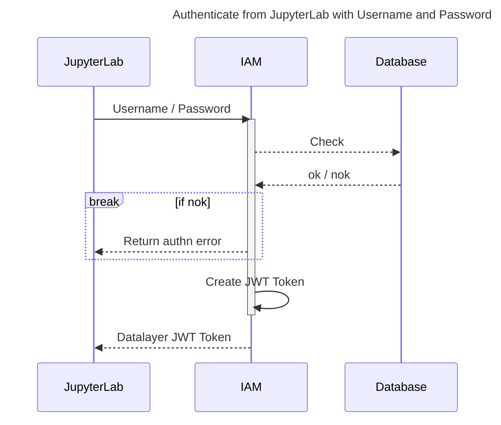
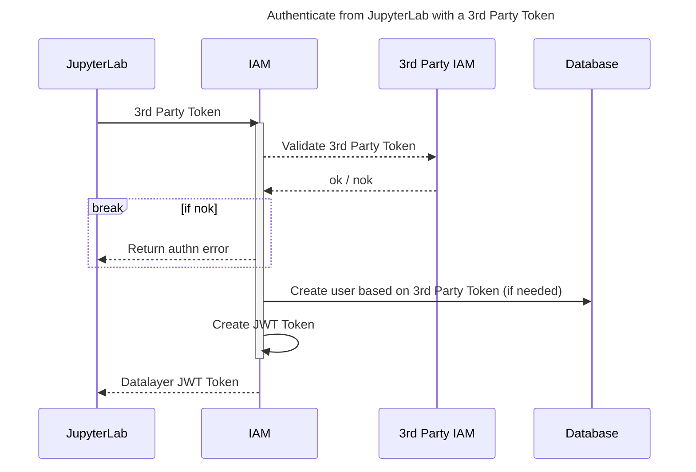
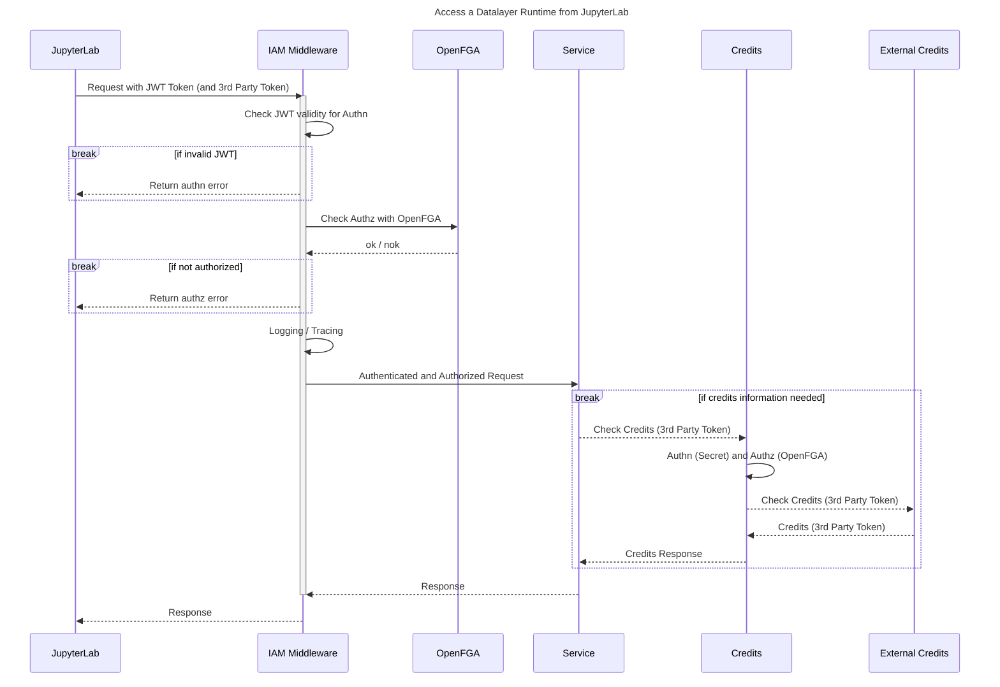
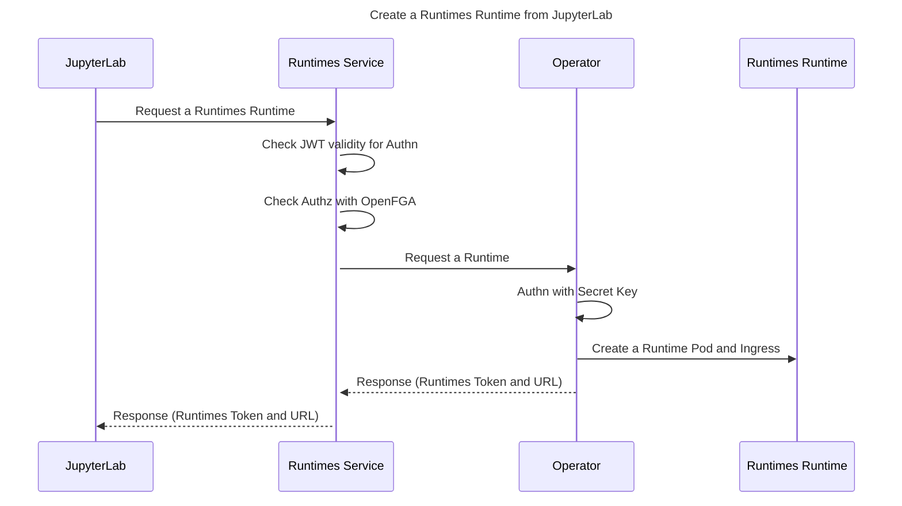
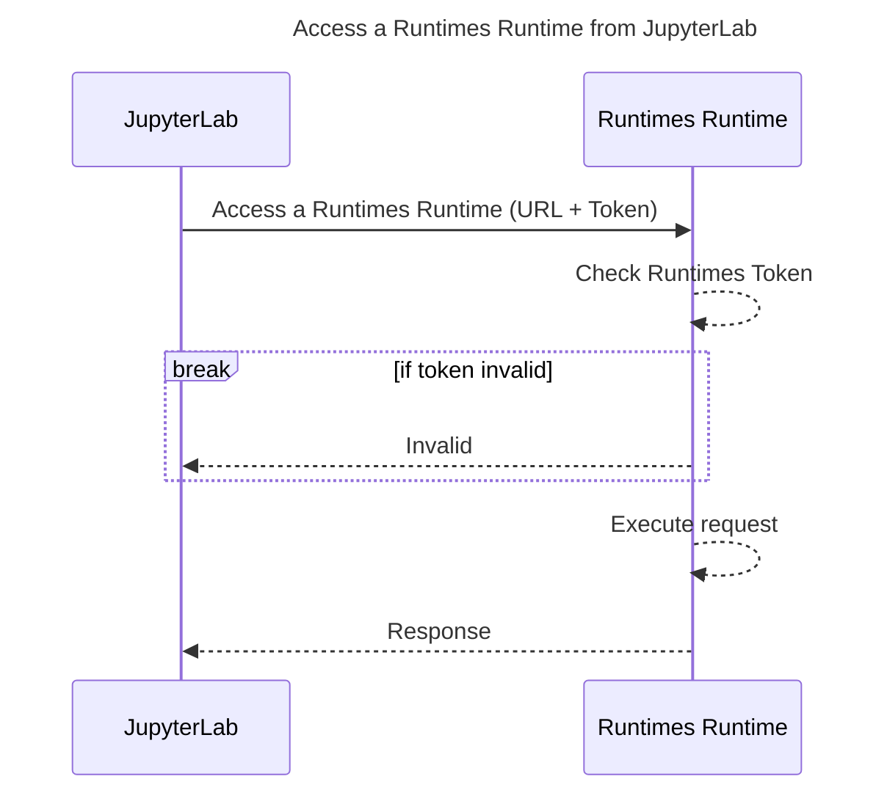

import Tabs from '@theme/Tabs';
import TabItem from '@theme/TabItem';
import { Label, Stack } from '@primer/react-brand';

# ☰ 🛂 Datalayer IAM

<Stack direction="horizontal" alignItems="flex-start" padding="none" style={{marginBottom: 30}}>
  <Label color="blue">Kubernetes</Label>
  <Label color="red">REST API</Label>
</Stack>

`Datalayer IAM` service provides the Identity and Access management to Datalayer and supports a variety of Authentication and Authorisation methods. It allows to manage the following artifacts.

```
🛂 Personal and Organisation Accounts.

🧑‍🤝‍🧑 Teams.

🛡️ Authorization Policies.
```

## The OAuth 2.1 authorization server

IAM is where an MCP client authenticates. It serves the endpoints an agent
discovers through RFC 8414 metadata — `/api/iam/v1/oauth/authorize`,
`/token`, `/revoke`, `/register` — and the
`/.well-known/oauth-authorization-server` document that points at them. The
[Jupyter MCP Server](/services/jupyter-mcp-server/) is the resource those
tokens are issued *for*, and refuses one issued for anything else.

### How a client is registered

By **Client ID Metadata Document**: the `client_id` is a URL that IAM
fetches, validates and caches, and the document at it declares the client's
name, its redirect URIs and what it may ask for. Advertised as
`client_id_metadata_document_supported` in the metadata, so a client
discovers it rather than being told.

Dynamic Client Registration (RFC 7591, `/oauth/register`) still works and is
the deprecated fallback. A document needs no registration call and no stored
secret, which is what makes it right for a client that discovers servers at
runtime.

The fetch is bounded, and the bounds are the security properties rather than
tuning:

| | |
|---|---|
| Timeout | 3 s for the whole fetch — connect, send, read |
| Redirects | 3, all on the same host |
| JWKS | 64 KiB |
| Logo | 256 KiB |
| Cache | 5 min to 24 h; 1 h where the document says nothing |

A client's document lives on the client's own server, so fetching it is IAM
reaching out to a third party during an authorization. The timeout and the
size caps are what stop that server from holding an authorization open or
handing back a download. Redirects stay on the host because the hostname
**is** the client's identity: following one off-host would let a document
delegate its identity to somewhere the person approving it never saw.

:::note `no-store` gets the *lower bound*, not no caching

A document refetched on every request would let the client's server watch
every authorization its client is part of — who signs in, when, how often.
The cache exists to prevent that, so a document asking not to be cached is
still held for five minutes.
:::

A URL client authenticates at the token endpoint with `none` or
`private_key_jwt`, never a shared secret: a document anybody can read cannot
hold one. The symmetric methods remain for the deprecated registration path.

### Redirect URIs, and the one exception

A redirect URI is matched **exactly** against the client's document — the
whole string as the client wrote it, never a prefix, never a different
scheme, path, query or fragment.

The exception is the **port of a loopback address**, where any port is
accepted.

:::warning This exception is not optional

RFC 8252 §7.3. A native application — Claude Code, Claude Desktop, any
desktop agent — listens on whatever port the operating system hands it *at
the moment it starts the flow*: `http://localhost:3118/callback` today,
something else tomorrow. No document can list those ports, because the
client does not know them when it is written.

Matching the port too refuses the client on its own callback:

```json
{"error":"invalid_request",
 "error_description":"Redirect URI [http://localhost:3118/callback] is not registered for this client."}
```

which reads to whoever hit it as the server being broken. If you see this
error, the host and the path are what to check — those are still compared
exactly, and `127.0.0.1` is a different address from `localhost` as far as
matching is concerned.
:::

Nothing else is relaxed. A public redirect gets no exception at all: there
the port *is* part of the address the client promised to be at.

### PKCE

Required, `S256` only. An authorization request without `code_challenge`, or
with `plain`, is refused before any browser is redirected — so the consent
screen only ever shows a request that would succeed.

### Scopes

What the `resource` parameter names wins over what the client asked for. The
resource is chosen by the person setting the client up, and it is the only
say they have over a client that sends whatever scopes it likes.

The OpenID Connect scopes — `openid`, `profile`, `email`, `offline_access` —
pass through so one sign-in answers both questions. None of them grants
anything on the MCP server.

The resource scopes are `notebooks:read`, `notebooks:write`, `code:execute`,
`data:read`, `data:write`, `tools:use` and `sandboxes:manage`. A request that
names **none** of them is offered all of them at consent, unticked, in that
order; a client that named one is offered nothing, because it knew what it
needed and the server does not second-guess it.

A scope is offered the day a tool requires it, and not before: a consent
screen listing something that grants nothing teaches a person that the screen
is noise, and the next screen they click past is one that mattered. `data:write`
and `tools:use` were withheld on that rule until 2026-09-04, when the
gateway's toolset and Contents tools began requiring them — until they were
offered, `enable_toolset` and `attach_content` were tools nobody arriving
through this screen could be given. Two tests hold the gateway's required
scopes and this list against each other in both directions, which is what
noticed.

### Grant types

`grant_types_supported` names five, and the token endpoint accepts exactly
those five — one list in `services/oauth_provider.py`, read by the OAuth
metadata, the OpenID document and the `unsupported_grant_type` refusal alike.

| Grant | Who uses it |
|---|---|
| `authorization_code` | Every MCP client, with PKCE |
| `refresh_token` | The same clients, to stay connected |
| `client_credentials` | A **service agent**, with its own uid and key: `sub` and `agent_uid` are the agent, and there is no person behind it |
| `urn:ietf:params:oauth:grant-type:jwt-bearer` | A registered client presenting a signed assertion as the grant itself (RFC 7523), verified against the keys its client document publishes |
| `urn:ietf:params:oauth:grant-type:token-exchange` | Datalayer services only |

:::note Token exchange is advertised, and refused to everyone but services

RFC 8693. The audience of an access token is what stops one minted for the
MCP gateway being replayed against another API — and the gateway genuinely
does need to call the Spacer on the user's behalf, holding a token that names
the gateway. It exchanges that token for one naming the Spacer.

It is in the metadata although only a trusted service may use it: the document
describes what the server **supports**, and who may use it is what the refusal
says — `invalid_client`, precisely. A capability left out of the description
because it is restricted is a capability nobody can discover is there, and
this one was omitted for exactly that reason until a test held the two lists
against each other.
:::

:::note Two ways for a client to be a principal with no person behind it

`client_credentials` takes a service agent's uid and key and answers a token
that is the **agent's own**: `sub` and `agent_uid` are the agent, and the
scopes are its registration narrowed to what it asked for. A wrong key is
`invalid_client` whichever way it is wrong — telling "unknown" from "revoked"
from "somebody else's" would be an oracle over other organizations' agents.

`jwt-bearer` (RFC 7523) takes a registered client's signed assertion as the
grant itself; the client document's published keys verify it, and what is
minted is a token for the client as a principal. See
[Service agents](#service-agents).
:::

### Organization, team and personal MCP policy

`/api/iam/v1/mcp-policies/{scope}/{subject_uid}` serves and stores the layers
the [Jupyter MCP Server](/services/jupyter-mcp-server/) enforces, at three
scopes: `organization`, `team` and `personal`. An organization's owner writes
its layer, a team's owner writes the team's within it, and a person writes
their own.

Six rules, and no others:

| Rule | Value |
|---|---|
| `toolDenylist` | Tool names refused |
| `toolAllowlist` | Tool names permitted, everything else refused |
| `allowedClients` | Client ids — a CIMD URL admits that client and no other |
| `maxCallsPerMinute` | Per-subject rate cap |
| `maxCreditsPerDay` | The daily budget |
| `maxConcurrentSandboxes` | Sandboxes running at once |

:::warning A rule IAM does not know is refused, not stored

The catalogue is kept beside the gateway's own `ENFORCED_RULES`. A rule the
gateway enforces but IAM does not list cannot be *saved* — harmless, and
visible immediately. The other way round is a policy page that lies: a rule
stored, displayed, and enforced by nothing.

So a mistyped `toolDenyList` is an error the administrator sees, rather than
a setting that quietly does nothing.
:::

The last three are the **quotas**. They are policy rules rather than a surface
of their own, because a second place to write a limit would be a second answer
to what an organization is allowed. The gateway reads them and refuses against
them; `GET /api/mcp/v1/organizations/{uid}/usage` puts each beside its use.

:::info A team layer cannot widen its organization's

The gateway intersects a team's layer with the organization's, so a team
owner who saves `maxCreditsPerDay: 500` under an organization capped at 100
gets 100 in practice. Until IAM refused it, the write was accepted and shown
on the page as 500 — a policy page that lied. IAM now refuses a team layer
wider than its organization's at the write (`400`, `WidensPolicy`): every
cap above the organization's ceiling, and a `toolAllowlist` that reaches
into the organization's `toolDenylist`. An organization layer IAM cannot
read does not block the write.
:::

### Alert rules

`McpAlertRule`, stored per organization. A rule names a condition, an
operator, a threshold, a window and a destination. IAM **refuses** a rule it
cannot evaluate — an unknown condition, a window of zero, a threshold of
`nan` — rather than storing it: a refused rule is visible, while a stored one
nobody can evaluate is a condition that looks watched and is not.

### Service agents

`/api/iam/v1/mcp-service-agents/…`, owned by an organization: created,
rotated and revoked by its owners. A pipeline, a CI job or a bot holds its own
key and spends the organization's credits under its own `agent_uid` — so the
work does not stop when the engineer who set it up leaves, and its spend is
attributed to it rather than to them.

They do **not** use `client_credentials`. The gateway presents the key to
`POST …/authenticate`, which answers with the principal, and the endpoint is
restricted to trusted services: anything that may call it may test keys.

:::note A bad key is a `401`, never a `200` with an empty principal

A caller that reads a truthful empty answer as an anonymous success is how an
unauthenticated agent gets a session.
:::

### `org_uid` and `team_uid` claims

Chosen at consent and stamped into the token. The gateway keys policy, quotas,
alerts and the audit on `org_uid`, so a token without one is a personal-scope
session. IAM validates the choice against membership before stamping it: a
person cannot act for an organization they do not belong to, and a team is
refused if it is not that organization's.

### The administrator routes require the role

`PUT /users/{id}/roles/{role}`, `DELETE /users/{id}`, `POST /api-keys/temporary`,
`PUT /credits/users/{user_id}` and the platform usage reads require
`platform_admin` (two of them accept `platform_growth_manager` as well), and
that is enforced by a dependency FastAPI resolves on each route.

It was not, until 2026-09-04. The routes were marked with a
`@require_auth(PLATFORM_ADMIN_AUTH)` decorator that sets two attributes on
the function and calls straight through — its own docstring says it is
"mainly for compatibility and marking functions as requiring auth". The
enforcement was meant to happen in `AuthnMiddleware`, which reads those
attributes; a `POST /api/iam/v1/api-keys/temporary` sent to prod1 with
nothing but an ordinary bearer token reached FastAPI's own body validation
and answered `422`, which is what a request that was never role-checked
looks like. The middleware also calls an `authz()` of a different signature
entirely, so where it does reach the check it raises, is caught, and would
refuse everyone; `AuthzMiddleware` is commented out. `DATALAYER_AUTHZ_ENGINE`
is `none`, which grants every tuple it is asked about.

So those routes were guarded by authentication alone — any account that
could log in could grant itself `platform_admin`, delete a user, or mint a
ten-minute key carrying another person's roles.

The decorator is left in place as documentation of intent, and is not the
guard. `require_auth(PLATFORM_MEMBER_AUTH)` — 120 of the 144 uses — is
deliberately still not enforced: it means "authenticated", and a service
authenticating with an API key has **no roles at all**, so requiring
membership there would refuse every service-to-service call in the platform.
Giving service identities a role is what that would need first.

### Deprovisioning revokes the agents that came with the membership

Removing somebody from an organization or a team revokes the OAuth grants
they hold **in that organization or team**, at the moment of removal. A grant
carries the `org_uid` it was consented in and a refresh mints the same scope,
so an agent left connected would go on acting for the organization after the
membership is gone — reading its policy, spending its budget and writing into
its audit.

Narrow on purpose. A deprovisioned member keeps their own agents and their
other employers': revoking every grant of theirs would take agents the
organization never granted and has no standing to revoke. A person removed
from an organization is removed from its teams first, and each team revokes
its own, because a team grant is not an organization grant.

Each revocation is an `oauth.token.revoke` audit row whose `via` is
`organization_membership_removed` or `team_membership_removed`, and whose
`user_uid` is the person it was for.

### What is not here yet

Named plainly, because the [MCP plan](/services/jupyter-mcp-server/) refers
to it and an operator should know:

- **DPoP.** Not implemented, and deliberately not built ahead of the Agent
  Identity Working Group's finalized MCP profile. Sender-constrained tokens
  are the right answer to a stolen bearer token, and building against a draft
  that then changes would leave a deployed proof format nobody else speaks.

## Where IAM's own audit rows go

IAM records its security decisions — a token issued, refused, exchanged or
revoked; a client document fetched or thrown out of the cache; an MCP policy
set or removed — in the same `McpAuditEvent` shape the gateway uses, so the
two halves of the story can be read together.

By default they go to the `datalayer_iam.audit` logger, one JSON line each,
for a log pipeline to forward. That is the right default: it works with no
Solr, in a container that only has stdout.

It also means those rows are **not queryable**. "Who changed this policy, and
when" has nowhere to be asked, and an auditor ends up reading half the story
from the console and half from a log aggregator — which in practice means
reading half.

To put them in `mcp-audit` beside the gateway's rows, so
`GET /api/mcp/v1/audit` answers both:

```yaml
env:
  - name: DATALAYER_IAM_AUDIT_SINK_CLASS
    value: datalayer_iam.services.audit_solr_sink:SolrAuditSink
```

| | |
| --- | --- |
| Written to the log as well | Always — it is what a failed collection write is recovered from |
| A failed collection write | Logged, **not raised** |
| A retried write | Answers the first row; the row's uid is its idempotency key |
| Timestamp | When IAM recorded the decision, not when Solr accepted it |

:::caution The swallow is deliberate
These rows are written on the path of **every token IAM issues**. Raising on
a failed audit write would turn a Solr blip into a refused sign-in.

A row missing from the collection is recoverable from the log. A platform
nobody can sign in to is not. If you alert on anything here, alert on the
`could not be written to mcp-audit` warning rather than on a gap in the
collection.
:::

## Deploy Datalayer IAM

<Tabs groupId="k8s">
  <TabItem value="plane" label="Plane" default>
```bash
plane up datalayer-iam
```
  </TabItem>
  <TabItem value="helm" label="Helm">
```bash
export RELEASE=datalayer-iam
export NAMESPACE=datalayer-api
helm upgrade \
  --install $RELEASE \
  oci://${DATALAYER_HELM_REGISTRY_HOST}/datalayer-charts/iam \
  --create-namespace \
  --namespace $NAMESPACE \
  --set iam.image="${DATALAYER_DOCKER_REGISTRY}/iam:0.1.1" \
  --set iam.certificateIssuer="letsencrypt" \
  --set iam.env.DATALAYER_RUN_HOST="${DATALAYER_RUN_HOST}" \
  --set iam.env.DATALAYER_CDN_URL="${DATALAYER_CDN_URL}" \
  --set iam.env.DATALAYER_RUNTIME_ENV="${DATALAYER_RUNTIME_ENV}" \
  --set iam.env.DATALAYER_IAM_API_KEY="${DATALAYER_IAM_API_KEY}" \
  --set iam.env.DATALAYER_JWT_ISSUER="${DATALAYER_JWT_ISSUER}" \
  --set iam.env.DATALAYER_JWT_SECRET="${DATALAYER_JWT_SECRET}" \
  --set iam.env.DATALAYER_JWT_ALLOWED_ISSUERS="${DATALAYER_JWT_ALLOWED_ISSUERS}" \
  --set iam.env.DATALAYER_JWT_ALGORITHM="${DATALAYER_JWT_ALGORITHM}" \
  --set iam.env.DATALAYER_JWT_DEFAULT_KID_ISSUER="${DATALAYER_JWT_DEFAULT_KID_ISSUER}" \
  --set iam.env.DATALAYER_JWT_SKIP_3RD_TOKEN_SIGNATURE_VERIFICATION="${DATALAYER_JWT_SKIP_3RD_TOKEN_SIGNATURE_VERIFICATION}" \
  --set iam.env.DATALAYER_AUTHZ_ENGINE="${DATALAYER_AUTHZ_ENGINE}" \
  --set iam.env.DATALAYER_CHECKOUT_PROVIDER="${DATALAYER_CHECKOUT_PROVIDER}" \
  --set iam.env.DATALAYER_SUPPORT_EMAIL="${DATALAYER_SUPPORT_EMAIL}" \
  --set iam.env.DATALAYER_SMTP_HOST="${DATALAYER_SMTP_HOST}" \
  --set iam.env.DATALAYER_SMTP_PORT="${DATALAYER_SMTP_PORT}" \
  --set iam.env.DATALAYER_SMTP_USERNAME="${DATALAYER_SMTP_USERNAME}" \
  --set iam.env.DATALAYER_SMTP_PASSWORD="${DATALAYER_SMTP_PASSWORD}" \
  --set iam.env.DATALAYER_GITHUB_CLIENT_ID="${DATALAYER_GITHUB_CLIENT_ID}" \
  --set iam.env.DATALAYER_GITHUB_CLIENT_SECRET="${DATALAYER_GITHUB_CLIENT_SECRET}" \
  --timeout 5m
```
  </TabItem>
  <TabItem value="terraform" label="Terraform">
```bash
cd terraform
terraform init
terraform apply
./generated/clouder-Kubeadm-setup.sh
export KUBECONFIG=~/.clouder/kubeadm/<cluster-name>/kubeconfig
./generated/services/deploy-datalayer-iam.sh
```
  </TabItem>
</Tabs>

<Tabs groupId="k8s">
  <TabItem value="plane" label="Plane" default>
```bash
plane ls
```
  </TabItem>
  <TabItem value="helm" label="Helm">
```bash
helm ls -A
```
  </TabItem>
</Tabs>

Check the availability of the Datalayer IAM Pods.

```bash
kubectl get pods -n datalayer-api -l app=iam
```

Check the logs of the Datalayer IAM Pods.

```bash
kubectl logs -n datalayer-api -l app=iam -f
```

Check the availability of the Datalayer IAM Certificate.

```bash
kubectl describe certificate ${DATALAYER_RUN_HOST}-datalayer-api-cert-secret -n datalayer-api
```

Check the availability of the Datalayer IAM Endpoints.

```bash
open https://${DATALAYER_RUN_HOST}/api/iam/version
open https://${DATALAYER_RUN_HOST}/api/iam/v1/ping
```

## Tear Down Datalayer IAM

If needed, tear down.

<Tabs groupId="k8s">
  <TabItem value="plane" label="Plane" default>
```bash
plane down datalayer-iam
```
  </TabItem>
  <TabItem value="helm" label="Helm">
```bash
export RELEASE=datalayer-iam
export NAMESPACE=datalayer-api
helm delete $RELEASE --namespace $NAMESPACE
```
  </TabItem>
</Tabs>

## OpenAPI Specification

The OpenAPI (Swagger) specification is [available online](https://prod1.datalayer.run/api/iam/v1/docs).

## IAM Cases

The following diagrams describe the authentication (Authn) and authorization (Authz) in various cases.

All interactions between JupyterLab and the Datalayer services are over TLS/SSL (HTTP or WebSocket) via the Ingress.

### Authenticate from JupyterLab with Username and Password



### Authenticate from JupyterLab with a 3rd Party Token



### Access a Datalayer Runtime from JupyterLab



### Create a Runtimes Runtime from JupyterLab



### Access a Runtimes Runtime from JupyterLab



### IAM at Ingress Level

In order to use `Datalayer IAM` as a Nginx Ingress middleware checking the user identity and authorization, the Ingress specification must have the following annotation (any service can be protected, aka forcing authentication and passing policies, using the following annotation on the Ingress).

```yaml
apiVersion: networking.k8s.io/v1
kind: Ingress
metadata:
  annotations:
    nginx.ingress.kubernetes.io/auth-url: "http://datalayer-iam-svc.datalayer-api.svc.cluster.local:9700/api/iam/v1/auth"
    nginx.ingress.kubernetes.io/auth-snippet: |
      proxy_set_header X-Forwarded-Method $request_method;
      proxy_set_header X-Forwarded-Proto $scheme;
      proxy_set_header X-Forwarded-Host $host;
      proxy_set_header X-Forwarded-Uri $scheme://$host$request_uri;
```
