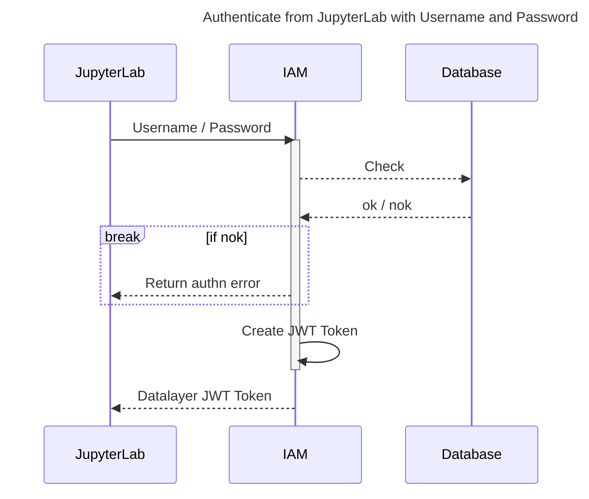
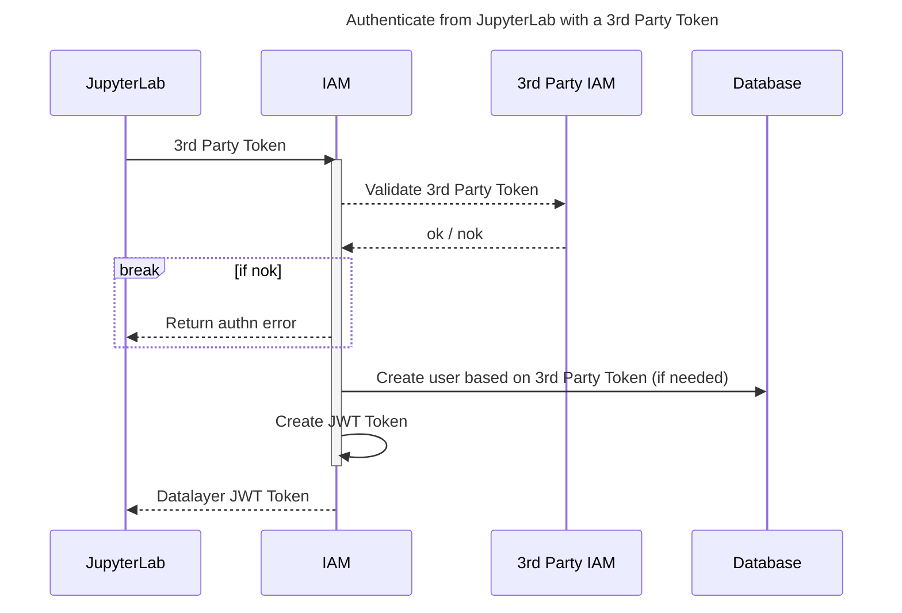
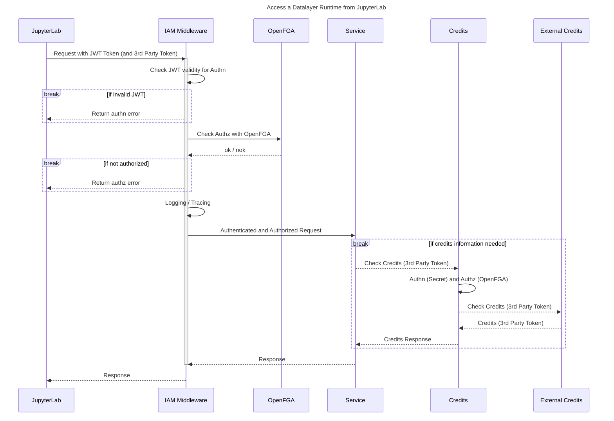
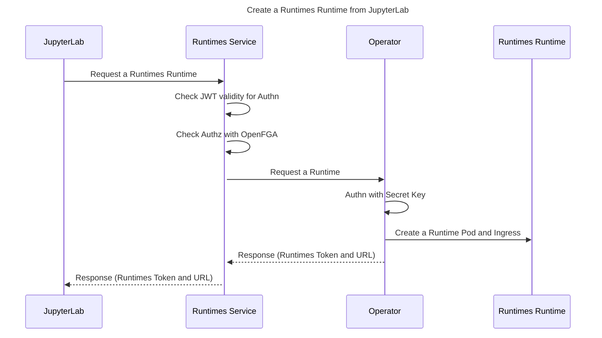
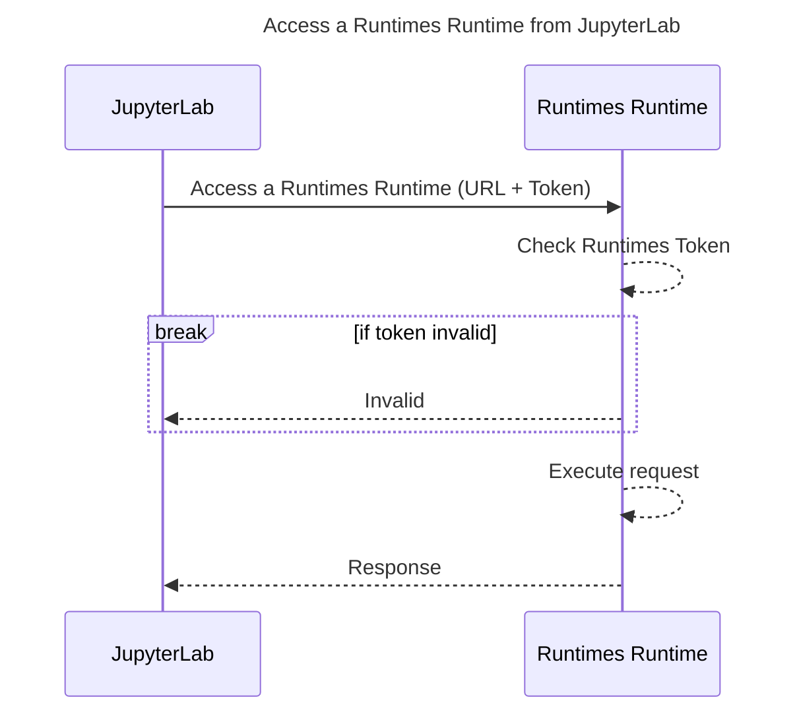

import Tabs from '@theme/Tabs';
import TabItem from '@theme/TabItem';
import { Label, Stack } from '@primer/react-brand';

# ☰ 🛂 Datalayer IAM

<Stack direction="horizontal" alignItems="flex-start" padding="none" style={{marginBottom: 30}}>
  <Label color="blue">Kubernetes</Label>
  <Label color="red">REST API</Label>
</Stack>

`Datalayer IAM` service provides the Identity and Access management to Datalayer and supports a variety of Authentication and Authorisation methods. It allows to manage the following artifacts.

```
🛂 Personal and Organisation Accounts.

🧑‍🤝‍🧑 Teams.

🛡️ Authorization Policies.
```

## The OAuth 2.1 authorization server

IAM is where an MCP client authenticates. It serves the endpoints an agent
discovers through RFC 8414 metadata — `/api/iam/v1/oauth/authorize`,
`/token`, `/revoke`, `/register` — and the
`/.well-known/oauth-authorization-server` document that points at them. The
[Jupyter MCP Server](/services/jupyter-mcp-server/) is the resource those
tokens are issued *for*, and refuses one issued for anything else.

### How a client is registered

By **Client ID Metadata Document**: the `client_id` is a URL that IAM
fetches, validates and caches, and the document at it declares the client's
name, its redirect URIs and what it may ask for. Advertised as
`client_id_metadata_document_supported` in the metadata, so a client
discovers it rather than being told.

Dynamic Client Registration (RFC 7591, `/oauth/register`) still works and is
the deprecated fallback. A document needs no registration call and no stored
secret, which is what makes it right for a client that discovers servers at
runtime.

### Redirect URIs, and the one exception

A redirect URI is matched **exactly** against the client's document — the
whole string as the client wrote it, never a prefix, never a different
scheme, path, query or fragment.

The exception is the **port of a loopback address**, where any port is
accepted.

:::warning This exception is not optional

RFC 8252 §7.3. A native application — Claude Code, Claude Desktop, any
desktop agent — listens on whatever port the operating system hands it *at
the moment it starts the flow*: `http://localhost:3118/callback` today,
something else tomorrow. No document can list those ports, because the
client does not know them when it is written.

Matching the port too refuses the client on its own callback:

```json
{"error":"invalid_request",
 "error_description":"Redirect URI [http://localhost:3118/callback] is not registered for this client."}
```

which reads to whoever hit it as the server being broken. If you see this
error, the host and the path are what to check — those are still compared
exactly, and `127.0.0.1` is a different address from `localhost` as far as
matching is concerned.
:::

Nothing else is relaxed. A public redirect gets no exception at all: there
the port *is* part of the address the client promised to be at.

### PKCE

Required, `S256` only. An authorization request without `code_challenge`, or
with `plain`, is refused before any browser is redirected — so the consent
screen only ever shows a request that would succeed.

### Scopes

What the `resource` parameter names wins over what the client asked for. The
resource is chosen by the person setting the client up, and it is the only
say they have over a client that sends whatever scopes it likes.

The OpenID Connect scopes — `openid`, `profile`, `email`, `offline_access` —
pass through so one sign-in answers both questions. None of them grants
anything on the MCP server.

### What is not here yet

Named plainly, because the [MCP plan](/services/jupyter-mcp-server/) refers
to several of these and an operator should know which exist:

- **DPoP.** Not implemented, and deliberately not built ahead of the Agent
  Identity Working Group's finalized MCP profile.
- **`client_credentials` and `jwt-bearer` grants**, and **service agents** as
  principals of their own with keys and rotation. The client half is written
  in `agent-runtimes`; IAM does not yet issue these.
- **Organization and personal MCP policy.** The gateway fetches, caches and
  *enforces* these layers already — a tool denylist, a client allowlist, a
  per-minute cap — but IAM serves none of them, so every rule currently
  reads "Datalayer default" and nothing narrows.
- **Quotas** as the agent dimension of the plan limits, and **`McpAlertRule`**.
  The reservation side of quotas has landed: a credits reservation now
  carries which client and which service agent asked for it, so usage can be
  grouped by agent. What is missing is the limit to enforce against.
- **`org_uid`/`team_uid` claims** chosen at consent. The gateway reads them
  from the token and narrows audit, policy and spend by them; until IAM
  stamps them, every session is personal scope.

## Where IAM's own audit rows go

IAM records its security decisions — a token issued, refused, exchanged or
revoked; a client document fetched or thrown out of the cache; an MCP policy
set or removed — in the same `McpAuditEvent` shape the gateway uses, so the
two halves of the story can be read together.

By default they go to the `datalayer_iam.audit` logger, one JSON line each,
for a log pipeline to forward. That is the right default: it works with no
Solr, in a container that only has stdout.

It also means those rows are **not queryable**. "Who changed this policy, and
when" has nowhere to be asked, and an auditor ends up reading half the story
from the console and half from a log aggregator — which in practice means
reading half.

To put them in `mcp-audit` beside the gateway's rows, so
`GET /api/mcp/v1/audit` answers both:

```yaml
env:
  - name: DATALAYER_IAM_AUDIT_SINK_CLASS
    value: datalayer_iam.services.audit_solr_sink:SolrAuditSink
```

| | |
| --- | --- |
| Written to the log as well | Always — it is what a failed collection write is recovered from |
| A failed collection write | Logged, **not raised** |
| A retried write | Answers the first row; the row's uid is its idempotency key |
| Timestamp | When IAM recorded the decision, not when Solr accepted it |

:::caution The swallow is deliberate
These rows are written on the path of **every token IAM issues**. Raising on
a failed audit write would turn a Solr blip into a refused sign-in.

A row missing from the collection is recoverable from the log. A platform
nobody can sign in to is not. If you alert on anything here, alert on the
`could not be written to mcp-audit` warning rather than on a gap in the
collection.
:::

## Deploy Datalayer IAM

<Tabs groupId="k8s">
  <TabItem value="plane" label="Plane" default>
```bash
plane up datalayer-iam
```
  </TabItem>
  <TabItem value="helm" label="Helm">
```bash
export RELEASE=datalayer-iam
export NAMESPACE=datalayer-api
helm upgrade \
  --install $RELEASE \
  oci://${DATALAYER_HELM_REGISTRY_HOST}/datalayer-charts/iam \
  --create-namespace \
  --namespace $NAMESPACE \
  --set iam.image="${DATALAYER_DOCKER_REGISTRY}/iam:0.1.1" \
  --set iam.certificateIssuer="letsencrypt" \
  --set iam.env.DATALAYER_RUN_HOST="${DATALAYER_RUN_HOST}" \
  --set iam.env.DATALAYER_CDN_URL="${DATALAYER_CDN_URL}" \
  --set iam.env.DATALAYER_RUNTIME_ENV="${DATALAYER_RUNTIME_ENV}" \
  --set iam.env.DATALAYER_IAM_API_KEY="${DATALAYER_IAM_API_KEY}" \
  --set iam.env.DATALAYER_JWT_ISSUER="${DATALAYER_JWT_ISSUER}" \
  --set iam.env.DATALAYER_JWT_SECRET="${DATALAYER_JWT_SECRET}" \
  --set iam.env.DATALAYER_JWT_ALLOWED_ISSUERS="${DATALAYER_JWT_ALLOWED_ISSUERS}" \
  --set iam.env.DATALAYER_JWT_ALGORITHM="${DATALAYER_JWT_ALGORITHM}" \
  --set iam.env.DATALAYER_JWT_DEFAULT_KID_ISSUER="${DATALAYER_JWT_DEFAULT_KID_ISSUER}" \
  --set iam.env.DATALAYER_JWT_SKIP_3RD_TOKEN_SIGNATURE_VERIFICATION="${DATALAYER_JWT_SKIP_3RD_TOKEN_SIGNATURE_VERIFICATION}" \
  --set iam.env.DATALAYER_AUTHZ_ENGINE="${DATALAYER_AUTHZ_ENGINE}" \
  --set iam.env.DATALAYER_CHECKOUT_PROVIDER="${DATALAYER_CHECKOUT_PROVIDER}" \
  --set iam.env.DATALAYER_SUPPORT_EMAIL="${DATALAYER_SUPPORT_EMAIL}" \
  --set iam.env.DATALAYER_SMTP_HOST="${DATALAYER_SMTP_HOST}" \
  --set iam.env.DATALAYER_SMTP_PORT="${DATALAYER_SMTP_PORT}" \
  --set iam.env.DATALAYER_SMTP_USERNAME="${DATALAYER_SMTP_USERNAME}" \
  --set iam.env.DATALAYER_SMTP_PASSWORD="${DATALAYER_SMTP_PASSWORD}" \
  --set iam.env.DATALAYER_GITHUB_CLIENT_ID="${DATALAYER_GITHUB_CLIENT_ID}" \
  --set iam.env.DATALAYER_GITHUB_CLIENT_SECRET="${DATALAYER_GITHUB_CLIENT_SECRET}" \
  --timeout 5m
```
  </TabItem>
  <TabItem value="terraform" label="Terraform">
```bash
cd terraform
terraform init
terraform apply
./generated/clouder-Kubeadm-setup.sh
export KUBECONFIG=~/.clouder/kubeadm/<cluster-name>/kubeconfig
./generated/services/deploy-datalayer-iam.sh
```
  </TabItem>
</Tabs>

<Tabs groupId="k8s">
  <TabItem value="plane" label="Plane" default>
```bash
plane ls
```
  </TabItem>
  <TabItem value="helm" label="Helm">
```bash
helm ls -A
```
  </TabItem>
</Tabs>

Check the availability of the Datalayer IAM Pods.

```bash
kubectl get pods -n datalayer-api -l app=iam
```

Check the logs of the Datalayer IAM Pods.

```bash
kubectl logs -n datalayer-api -l app=iam -f
```

Check the availability of the Datalayer IAM Certificate.

```bash
kubectl describe certificate ${DATALAYER_RUN_HOST}-datalayer-api-cert-secret -n datalayer-api
```

Check the availability of the Datalayer IAM Endpoints.

```bash
open https://${DATALAYER_RUN_HOST}/api/iam/version
open https://${DATALAYER_RUN_HOST}/api/iam/v1/ping
```

## Tear Down Datalayer IAM

If needed, tear down.

<Tabs groupId="k8s">
  <TabItem value="plane" label="Plane" default>
```bash
plane down datalayer-iam
```
  </TabItem>
  <TabItem value="helm" label="Helm">
```bash
export RELEASE=datalayer-iam
export NAMESPACE=datalayer-api
helm delete $RELEASE --namespace $NAMESPACE
```
  </TabItem>
</Tabs>

## OpenAPI Specification

The OpenAPI (Swagger) specification is [available online](https://prod1.datalayer.run/api/iam/v1/docs).

## IAM Cases

The following diagrams describe the authentication (Authn) and authorization (Authz) in various cases.

All interactions between JupyterLab and the Datalayer services are over TLS/SSL (HTTP or WebSocket) via the Ingress.

### Authenticate from JupyterLab with Username and Password



### Authenticate from JupyterLab with a 3rd Party Token



### Access a Datalayer Runtime from JupyterLab



### Create a Runtimes Runtime from JupyterLab



### Access a Runtimes Runtime from JupyterLab



### IAM at Ingress Level

In order to use `Datalayer IAM` as a Nginx Ingress middleware checking the user identity and authorization, the Ingress specification must have the following annotation (any service can be protected, aka forcing authentication and passing policies, using the following annotation on the Ingress).

```yaml
apiVersion: networking.k8s.io/v1
kind: Ingress
metadata:
  annotations:
    nginx.ingress.kubernetes.io/auth-url: "http://datalayer-iam-svc.datalayer-api.svc.cluster.local:9700/api/iam/v1/auth"
    nginx.ingress.kubernetes.io/auth-snippet: |
      proxy_set_header X-Forwarded-Method $request_method;
      proxy_set_header X-Forwarded-Proto $scheme;
      proxy_set_header X-Forwarded-Host $host;
      proxy_set_header X-Forwarded-Uri $scheme://$host$request_uri;
```
