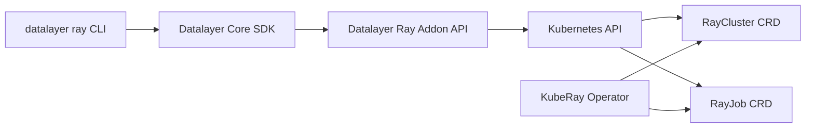

import Tabs from '@theme/Tabs';
import TabItem from '@theme/TabItem';
import { Label, Stack } from '@primer/react-brand';

# ☰ ⚡ Datalayer Ray Addon

<Stack direction="horizontal" alignItems="flex-start" padding="none" style={{marginBottom: 30}}>
  <Label color="blue">Kubernetes</Label>
  <Label color="red">Addons</Label>
</Stack>

## Deploy Datalayer Ray Addon

<Tabs groupId="k8s">
  <TabItem value="plane" label="Plane" default>
```bash
export DATALAYER_RUN_URL=https://r-eastus.datalayer.run
plane up datalayer-ray
```
  </TabItem>
  <TabItem value="helm" label="Helm">
```bash
export RELEASE=datalayer-ray
export NAMESPACE=datalayer-api
...
```
  </TabItem>
  <TabItem value="terraform" label="Terraform">
```bash
cd terraform
...
```
  </TabItem>
</Tabs>

<Tabs groupId="k8s">
  <TabItem value="plane" label="Plane" default>
```bash
plane ls
```
  </TabItem>
  <TabItem value="helm" label="Helm">
```bash
helm ls -A
```
  </TabItem>
</Tabs>

## Overview

This page describes the productized Ray addon architecture for Datalayer services.

The design follows KubeRay recommendations:

1. KubeRay Operator manages `RayCluster`, `RayJob`, and `RayService` CRDs.
2. A Datalayer addon API provides a stable REST surface for Datalayer CLI and SDK.
3. A dedicated `datalayer-ray` chart deploys the addon API and can install KubeRay.

For Ray and KubeRay references, see:

- [Ray on Kubernetes](https://docs.ray.io/en/latest/cluster/kubernetes/index.html)
- [KubeRay GitHub](https://github.com/ray-project/kuberay)

## Goals

1. Expose a simple REST API to create/list/delete Ray clusters.
2. Expose a simple REST API to submit and monitor Ray jobs.
3. Integrate this API in `datalayer ray ...` CLI and SDK primitives.
4. Package deployables for production usage via Plane and Helm.

## Current Architecture



## REST API Contract

Base path: `/api/ray/v1`

All resource endpoints are authenticated and require `platform_member` role.

### Health and Version

1. `GET /healthz`
2. `GET /api/ray/v1/version`

### RayCluster Management

1. `GET /api/ray/v1/clusters?namespace=<ns>`
2. `POST /api/ray/v1/clusters`
3. `GET /api/ray/v1/clusters/{name}?namespace=<ns>`
4. `DELETE /api/ray/v1/clusters/{name}?namespace=<ns>`

### RayJob Management

1. `POST /api/ray/v1/clusters/{cluster_name}/jobs`
2. `GET /api/ray/v1/jobs?namespace=<ns>&cluster_name=<optional>`
3. `GET /api/ray/v1/jobs/{name}?namespace=<ns>`
4. `DELETE /api/ray/v1/jobs/{name}?namespace=<ns>`
5. `GET /api/ray/v1/jobs/{name}/logs?namespace=<ns>&pod_name=<optional>&container=<optional>&tail_lines=200`
6. `GET /api/ray/v1/jobs/{name}/events?namespace=<ns>&limit=100`

## Core CLI and SDK

Python Core now exposes:

1. New URL config: `DATALAYER_RUN_URL`
  - Default: `https://prod1.datalayer.run`
2. SDK primitives through `RayMixin`:
   - `ray_list_clusters`, `ray_create_cluster`, `ray_get_cluster`, `ray_delete_cluster`
  - `ray_submit_job`, `ray_list_jobs`, `ray_get_job`, `ray_delete_job`
  - `ray_get_job_logs`, `ray_get_job_events`
3. CLI command group:
  - `datalayer ray clusters ls|list|get|create|delete`
  - `datalayer ray jobs ls|list|submit|status|monitor|delete|logs|events`

## Point to a Non-Default Ray URL

Use any of the following when your Ray addon is not exposed on `https://prod1.datalayer.run`.

1. Per command override:

```bash
datalayer ray jobs ls --ray-url https://ray.my-company.net --namespace default
```

2. Global override for one CLI invocation:

```bash
datalayer --ray-url https://ray.my-company.net ray clusters ls --namespace default
```

3. Environment variable override (current shell):

```bash
export DATALAYER_RUN_URL=https://ray.my-company.net
```

To keep this override across terminal sessions on Linux/macOS:

```bash
echo 'export DATALAYER_RUN_URL=https://ray.my-company.net' >> ~/.bashrc
source ~/.bashrc
```

## Deployment

### Helm Chart

Behavior:

1. Deploy `datalayer-ray` API service.
2. Install `kuberay-operator` as a chart dependency (enabled by default).
3. Optionally bootstrap a default `RayCluster` via `bootstrapRayCluster.enabled=true`.

## Autoscaling

Ray worker autoscaling is supported through KubeRay and enabled by default for bootstrap and API-created clusters.

When enabled, the RayCluster spec includes:

1. `spec.enableInTreeAutoscaling: true`
2. Worker bounds from `minReplicas` and `maxReplicas`

Relevant defaults in `datalayer-ray` chart values:

```yaml
bootstrapRayCluster:
  autoscaling:
    enabled: true
  worker:
    replicas: 1
    minReplicas: 1
    maxReplicas: 3
```

Notes:

1. Autoscaling acts within each worker group's `minReplicas`/`maxReplicas` bounds.
2. Existing RayClusters need an update/recreate to pick up newly enabled autoscaling fields.

Ingress host for `plane up datalayer-ray` is resolved from `DATALAYER_RUN_URL`.

## Usage

### Cluster lifecycle

```bash
datalayer ray clusters create my-ray --namespace default --worker-replicas 2
datalayer ray clusters list --namespace default
datalayer ray clusters get my-ray --namespace default
```

### Submit and check a job

```bash
datalayer ray jobs submit my-ray --namespace default --entrypoint "python /workspace/train.py"
datalayer ray jobs list --namespace default --cluster-name my-ray
datalayer ray jobs status my-ray-job-<timestamp> --namespace default
datalayer ray jobs logs my-ray-job-<timestamp> --namespace default --tail-lines 300
datalayer ray jobs events my-ray-job-<timestamp> --namespace default --limit 100
```

## Hands-On Examples

This section is fully copy/paste friendly and does not depend on repository file paths.

### Prerequisites

```bash
export DATALAYER_RUN_URL=https://r-eastus.datalayer.run
# Set your token if not already stored by datalayer login
export DATALAYER_API_KEY=<your-token>
```

### 1) Simple health and connectivity

```bash
# Verify the Ray addon API is healthy.
curl -sS "${DATALAYER_RUN_URL}/api/ray/v1/version" \
  -H "Authorization: Bearer ${DATALAYER_API_KEY}" | jq

# List clusters through the Datalayer CLI.
datalayer ray clusters ls --namespace default
```

### 2) Create a cluster and scale up/down

```bash
# Create a Ray cluster.
datalayer ray clusters create  my-ray --namespace default --worker-replicas 1

# Verify state.
datalayer ray clusters get  my-ray --namespace default

# Scale up workers to 3.
kubectl -n default patch raycluster  my-ray --type='json' -p='[
  {"op":"replace","path":"/spec/workerGroupSpecs/0/replicas","value":3},
  {"op":"replace","path":"/spec/workerGroupSpecs/0/minReplicas","value":1},
  {"op":"replace","path":"/spec/workerGroupSpecs/0/maxReplicas","value":6}
]'

# Confirm scale-up.
datalayer ray clusters get  my-ray --namespace default

# Scale down workers to 0.
kubectl -n default patch raycluster  my-ray --type='json' -p='[
  {"op":"replace","path":"/spec/workerGroupSpecs/0/replicas","value":0},
  {"op":"replace","path":"/spec/workerGroupSpecs/0/minReplicas","value":0},
  {"op":"replace","path":"/spec/workerGroupSpecs/0/maxReplicas","value":6}
]'

# Confirm scale-down.
datalayer ray clusters get  my-ray --namespace default
```

### 3) Run a real Python file

No intermediary file creation or copy is required.
`--py` supports multiline source via stdin (`@-`).

#### Example A: Hello Ray

```bash
datalayer ray jobs submit  my-ray --namespace default --job-name hello-ray --py @- <<'PY'
import ray

ray.init(address="auto")

def square(x: int) -> int:
  return x * x

remote_square = ray.remote(square)
nums = list(range(10))
print("Output:", ray.get([remote_square.remote(n) for n in nums]))
PY

datalayer ray jobs monitor hello-ray --namespace default
datalayer ray jobs logs hello-ray --namespace default --tail-lines 200
```

#### Example B: Monte Carlo Pi

```bash
datalayer ray jobs submit my-ray --namespace default --job-name pi-monte-carlo --py @- <<'PY'
import random
import ray

ray.init(address="auto")

workers = 16
samples_per_worker = 100_000

def count_inside(num_samples: int) -> int:
  inside = 0
  for _ in range(num_samples):
    x = random.random()
    y = random.random()
    if x * x + y * y <= 1.0:
      inside += 1
  return inside

remote_count_inside = ray.remote(count_inside)
inside_total = sum(ray.get([remote_count_inside.remote(samples_per_worker) for _ in range(workers)]))
total_samples = workers * samples_per_worker
pi_estimate = 4.0 * inside_total / total_samples

print("Workers:", workers)
print("Samples per worker:", samples_per_worker)
print("Total samples:", total_samples)
print("Estimated pi:", pi_estimate)
PY

datalayer ray jobs monitor pi-monte-carlo --namespace default
datalayer ray jobs logs pi-monte-carlo --namespace default --tail-lines 200
```

#### Example C: Stateful Actor Counter

```bash
datalayer ray jobs submit my-ray --namespace default --job-name actor-counter --py @- <<'PY'
import ray

ray.init(address="auto")

class Counter:
  def __init__(self):
    self.value = 0

  def add(self, amount: int) -> int:
    self.value += amount
    return self.value

  def get(self) -> int:
    return self.value

RemoteCounter = ray.remote(Counter)
counters = [RemoteCounter.remote() for _ in range(4)]

for step in [1, 2, 3, 4, 5]:
  ray.get([c.add.remote(step) for c in counters])

totals = ray.get([c.get.remote() for c in counters])
print("Per-actor totals:", totals)
print("Grand total:", sum(totals))
PY

datalayer ray jobs monitor actor-counter --namespace default
datalayer ray jobs logs actor-counter --namespace default --tail-lines 200
```

## Security and RBAC

The chart creates a `ClusterRole` and `ClusterRoleBinding` allowing:

1. `rayclusters` and `rayjobs` CRUD across namespaces.
2. `pods` read/list/watch for job pod discovery.
3. `pods/log` read for job logs.
4. `events` read/list/watch for job events.

For multi-tenant clusters, prefer one namespace per team/project and deploy one addon instance per namespace.

## Implementation Phases

1. Phase 1 (done): API contract + core CLI/SDK + deploy artifacts.
2. Phase 2 (next): Add stricter authn/authz checks and audit metadata.
3. Phase 3 (next): Add richer job logs/events endpoints.
4. Phase 4 (next): Add `RayService` API support for long-running serving workloads.

## Open Questions To Confirm

1. Do we want organization/team scoped authz in this addon from day 1, or after internal validation?
2. Should we add `RayService` endpoints now or keep them for phase 4?
3. Do we standardize one namespace per account/team for all Ray resources?

## Delete the Cluster

```bash
datalayer ray jobs ls --namespace default --cluster-name  my-ray
datalayer ray clusters delete  my-ray --namespace default
```
